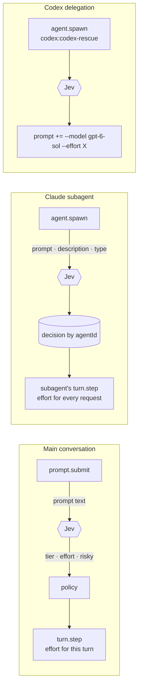

<div align="center">

# thinkdial

**Per-task reasoning effort for Claude Code, decided by a typed decision model.**

[](https://github.com/DmitryBMsk/thinkdial/actions/workflows/test.yml)
[](LICENSE)
[](https://github.com/anthropics/claude-code/tree/main/mods)
[](https://bun.sh)

</div>

`thinkdial` is a Claude Code **mod** (a plugin of function hooks). Before each turn it asks [Jev](https://typesafe.ai/blog/introducing-system-one-models-and-jev), TypeSafe's System One decision model, three typed questions about the task: how hard is it, how much reasoning does it need, and is it risky. It then sets the **reasoning effort** of the request:

- of the **main conversation**,
- of every **Claude subagent** the Agent tool starts,
- of every **Codex delegation** (`codex:codex-rescue`), as `--effort`.

It does not change which model answers, unless you turn that on (see [why not](#why-effort-only)). Every failure path is fail-open: if the classification is slow, errors out or makes no sense, the request goes out exactly as Claude Code built it.

> The plugin id is still `jev-model-router` (that is what Claude Code and your `pluginConfigs` know it by). The project is `thinkdial`.

---

## Contents

- [Why effort-only](#why-effort-only)
- [How it works](#how-it-works)
- [Quick start](#quick-start)
- [How it decides](#how-it-decides)
- [Subagents](#subagents)
- [Codex delegations](#codex-delegations)
- [Seeing what it did](#seeing-what-it-did)
- [Options](#options)
- [Troubleshooting](#troubleshooting)
- [Privacy and failure modes](#privacy-and-failure-modes)
- [Development](#development)
- [Credits and license](#credits-and-license)

---

## Why effort-only

The router started by routing **models** as well: haiku for mechanical turns, opus for hard ones. One user's week of real sessions, 1,174 routed main-loop turns across 133 sessions in late September 2026, showed why that loses money in a long Claude Code session:

| What changed at the start of a turn | Turns | Prompt-cache miss |
|---|---:|---:|
| nothing | 433 | **1 %** |
| effort only | 495 | **1 %** |
| model | 16 | **81 %** |
| model + effort | 20 | **70 %** |

- **The prompt cache belongs to each model.** A new model writes the whole conversation into its own cache before it answers, and in a long session that write is most of the request.
- **Cheaper models do not read the cache for less.** Claude Opus 5.5 and Claude Sonnet 5.5 charge the same $0.20 per million cached input tokens, and cache reads were about half of the spend. Moving from opus to sonnet mid-session saved almost nothing and paid for a full cache rewrite.
- **Effort is free to move.** Changing effort between turns did not invalidate the cache at all (1 % misses, the same as changing nothing). So effort is the dimension worth routing.

Model routing is still in the code, behind `routeMainModel` and `routeSubagentModel`, for anyone whose sessions look different. Measure your own before you turn it on: the decision log below has everything you need.

## How it works



1. **Classify once.** The main-loop prompt is classified at `prompt.submit`, before the turn starts. A subagent's prompt is classified at `agent.spawn`.
2. **Apply at the first request.** The decision is applied to the turn's first model request (`turn.step`) and reused by every later request of that turn, or of that subagent. Effort never changes inside a tool loop.
3. **Re-check every request.** The effort ceiling is checked against the model actually sent on each request, so a fallback to a smaller model never carries an effort meant for a bigger one.

## Quick start

**Requirements:** Claude Code **2.1.259+**, function hooks enabled, and a [TypeSafe](https://typesafe.ai) API key. Without a key the router still runs on Claude Code's built-in classifier, which reports no confidence and so can only raise effort, never lower it.

```sh
git clone https://github.com/DmitryBMsk/thinkdial.git ~/src/thinkdial

# load it for every project: a user-level skills folder is auto-loaded as jev-model-router@skills-dir
ln -s ~/src/thinkdial ~/.claude/skills/jev-model-router
```

Add this to `~/.claude/settings.json`. These are the recommended effort-only settings, and the defaults in the code differ from them, as noted below:

```jsonc
{
  "env": { "CLAUDE_CODE_ENABLE_FUNCTION_HOOKS": "1" },
  "pluginConfigs": {
    "jev-model-router@skills-dir": {
      "options": {
        "typesafeApiKey": "<your TypeSafe key>",
        "provider": "typesafe",
        "timeoutMs": 1500,

        "routeMainEffort": true,
        "routeSubagentEffort": true,
        "routeMainModel": false,          // default false
        "routeSubagentModel": false,      // default TRUE in code: set false for effort-only
        "codexFastModel": "gpt-6-sol",    // default gpt-6-luna: pin Codex to one model

        "mainEffortFloor": "medium",
        "mainBalancedEffortFloor": "high",
        "mainEffortCeiling": "high"
      }
    }
  }
}
```

Start `claude`. The first routed turn prints `[jev-model-router] ready on typesafe …; routing subagent effort, main effort`.

<details>
<summary><b>One session only, or a headless worker</b></summary>

```sh
CLAUDE_CODE_ENABLE_FUNCTION_HOOKS=1 claude --plugin-dir ~/src/thinkdial
```

Loaded this way the plugin's id is plain `jev-model-router`, so its options go under `"pluginConfigs": { "jev-model-router": { … } }`, for example in a file passed with `--settings`. For an isolated `claude -p` worker use `--restricted`, not `--safe-mode`: `--safe-mode` also switches off hooks loaded with `--plugin-dir`.

`claude plugin validate ~/src/thinkdial` prints every event the plugin hooks and every `$` call it makes.

</details>

## How it decides

Jev answers three questions in a single request:

| Question | Shape | Meaning |
|---|---|---|
| `tier` | choice of 3 | mechanical and local · ordinary engineering · hard or high-stakes. The decision model never sees a model name. |
| `effort` | score 0–3 | how much step-by-step reasoning the task needs: `low` · `medium` · `high` · `xhigh` |
| `risky` | probability | does it touch production, money, credentials or state that cannot be undone? |

The two kinds of mistake do not cost the same, so they do not clear the same bar:

- **Spending more** needs `minUpgradeConfidence` (0.3). A wrong call costs money.
- **Spending less** needs `minDowngradeConfidence` (0.6). A wrong call is a task done with too little thought.
- **`risky` above 0.7** forces at least `high` effort past both bars. It can raise effort but never lower it.
- **No confidence reported** (the built-in classifier, or the Gateway without a distribution) means the router may only move effort **up**.

On top of the decision sit three policy limits. They apply without a confidence check:

| Option | Effect |
|---|---|
| `mainEffortFloor` | lowest effort a turn may get, so a short "check this" prompt is not sent at `low` |
| `mainBalancedEffortFloor` | higher floor for a task read as ordinary engineering |
| `mainEffortCeiling` | highest effort below the deep tier, so `xhigh`/`max` are kept for opus-class models |

A slash command with nothing after it (`/simplify`) is not classified, because Jev would only see the command's name. That turn keeps the session's effort.

## Subagents

The Agent tool has no effort parameter, so the router sets a subagent's effort from inside its loop:

1. At `agent.spawn` it classifies the subagent's prompt, description and type.
2. When the spawn resolves, it stores the decision by `agentId`.
3. At the subagent's first `turn.step` it applies the effort, then reuses it for every later request and turn of that agent. If the first request overtakes the spawn, it waits for the spawn once, up to `timeoutMs`.

Subagents use the same floor and ceiling as the main loop. Some subagents are left alone:

| Case | Behaviour |
|---|---|
| definition pins `effort:` in its `.md` file | kept: `effort pinned by definition (medium)` |
| `--agents` / registered definition pins an effort on the session's model | kept, detected when its effort differs from the session's: `effort set by agent definition (high, session medium)` |
| model takes no effort (Haiku 4.5) | nothing sent: `model takes no effort` |
| fork, Codex delegation, or a plugin's own `$.agent.spawn` | untouched |

**Known limits.** The hook API does not say whether a subagent's effort was pinned. The router infers it, so a definition pinned to *the same level as the session* looks unpinned and may be routed. A pin on a *different* model given through `--agents` is not detected either. To make a pin certain, put `effort:` in the agent's `.md` file.

## Codex delegations

A `codex:codex-rescue` spawn gets `--model` and `--effort` flags prepended to its prompt, taken from the same decision. The rescue agent passes them on to Codex. With `codexFastModel` set to the same model as the other rungs, only the effort varies:

| Decision | Codex flags |
|---|---|
| no decision / ordinary | `gpt-6-sol` · `low` |
| ordinary, high effort | `gpt-6-sol` · `medium` |
| hard | `gpt-6-sol` · `high` (`xhigh` when the effort reads `xhigh`) |
| `risky` > 0.7 | `gpt-6-sol` · `xhigh` |

A prompt that already names `--model` or `--effort` is left alone: an explicit choice wins.

## Seeing what it did

The effort the router sets is a parameter of each request, so Claude Code's status line and effort box never show it. The router reports its own work in three places.

**Transcript lines** (when `logDecisions` is on):

```
[jev-model-router] ready on typesafe (https://api.typesafe.ai/v1/systemone); routing subagent effort, main effort
[jev-model-router] jev: tier deep (0.98) · effort 2.1 → high (0.70) · risky 0.09 · 612ms
[jev-model-router] main loop → effort high: deep (confidence 0.98)
[jev-model-router] general-purpose → effort high: deep (confidence 0.98)
[jev-model-router] ra-impl-medium: effort pinned by definition (medium)
```

**A status line**, replaced as it goes: `jev · deep 0.98 → high`.

**A decision log**, one JSONL file per session in `~/.claude/jev-router/<session-id>.jsonl` (no `--debug` needed, no prompt text):

```json
{"ts":"2026-10-04T10:12:41.204Z","event":"subagent","agentId":"ad05ecf8…","agentType":"general-purpose",
 "tier":"deep","confidence":0.98,"effort":2.02,"effortConfidence":0.68,"risky":0.07,
 "from":{"model":"claude-sonnet-5-5","effort":"medium","source":"parent"},
 "applied":{"effort":"high"},"reason":"deep (confidence 0.98)"}
```

`from` is what the request would have used untouched. `source` says where its model came from: `call`, `definition` or `parent`. `ran` appears when the first request used a different model. `applied` is what the router changed. For cost analysis, join these records to the per-request `usage` in your session transcripts by timestamp.

## Options

Set them under `pluginConfigs.<id>.options` in **user** settings (`~/.claude/settings.json`), with `--settings <file>`, in managed settings or through `/config`. The `<id>` depends on how the plugin was loaded: `jev-model-router@skills-dir` when it is auto-loaded from a skills folder, plain `jev-model-router` with `--plugin-dir`. Under the wrong key every option stays at its default, and the `ready on` line says `no key set`.

<details open>
<summary><b>Backend</b></summary>

| Option | Default | |
|---|---|---|
| `typesafeApiKey` | — | TypeSafe API key. Preferred, because it reports a calibrated confidence. |
| `gatewayApiKey` | — | Vercel AI Gateway key. Confidence is read from the optional distribution. |
| `provider` | `auto` | `auto` · `typesafe` · `gateway` · `builtin` |
| `typesafeBaseUrl` / `typesafeModel` | `https://api.typesafe.ai` / `jev-latest` | |
| `gatewayBaseUrl` / `gatewayModel` | `https://ai-gateway.vercel.sh/v4/ai` / `typesafe-ai/jev` | |
| `timeoutMs` | `800` | time limit for each classification. Past it the request goes out unchanged. |

</details>

<details open>
<summary><b>What to route</b></summary>

| Option | Default | |
|---|---|---|
| `routeMainEffort` | `true` | effort of the main conversation |
| `routeSubagentEffort` | `true` | effort of each Claude subagent |
| `routeCodexDelegation` | `true` | `--model` / `--effort` for `codex:codex-rescue` spawns |
| `routeMainModel` | `false` | model of the main conversation (breaks the prompt cache, see above) |
| `routeSubagentModel` | `true` | model of each subagent. **Set `false` for effort-only.** |

</details>

<details>
<summary><b>Policy</b></summary>

| Option | Default | |
|---|---|---|
| `minUpgradeConfidence` | `0.3` | confidence needed to spend more |
| `minDowngradeConfidence` | `0.6` | confidence needed to spend less |
| `mainEffortFloor` | — | lowest effort: `low`·`medium`·`high`·`xhigh` |
| `mainBalancedEffortFloor` | — | floor for a task read as ordinary engineering |
| `mainEffortCeiling` | — | highest effort below the deep tier |
| `mainModelFloor` | `balanced` | lowest tier the main loop's model may go to (model routing only) |
| `mainMinModelDowngradeConfidence` | `0.9` | confidence needed for a main-loop model downgrade |
| `mainModelMaxContextTokens` | `80000` | above this context size, a main-loop model switch is held, except a return to the session's starting model |
| `fastModel` / `balancedModel` / `deepModel` | `haiku` / `sonnet` / `opus` | the three tiers, as aliases or full ids |

</details>

<details>
<summary><b>Codex and logging</b></summary>

| Option | Default | |
|---|---|---|
| `codexAgentTypes` | `codex:codex-rescue` | comma-separated agent types treated as a Codex delegation |
| `codexFastModel` / `codexBalancedModel` / `codexDeepModel` | `gpt-6-luna` / `gpt-6-sol` / `gpt-6-sol` | the Codex ladder. Make all three the same to route effort only. |
| `logDecisions` | `true` | transcript lines and the status line |
| `decisionLog` | `true` | the per-session JSONL decision log |
| `decisionLogDir` | `~/.claude/jev-router` | where it is written |

</details>

## Troubleshooting

**No `[jev-model-router]` lines at all.** Check these in order:

1. **It is a headless run.** `claude -p` and the SDK have no transcript, so every line goes to `~/.claude/debug/<session-id>.txt`. The decision log is written either way.
2. **The plugin is not loaded.** `claude --debug` should print `hooks module jev-model-router@skills-dir loaded …; events: prompt.submit,turn.step,agent.spawn`. A plugin in a *project's* `.claude/skills/` is only read once that project is trusted; a user-level `~/.claude/skills/` link has no such step.
3. **Function hooks are off.** The debug log says `rollout flag (tengu_plugin_hooks_modules) is off`. Set `CLAUDE_CODE_ENABLE_FUNCTION_HOOKS=1`.

**`ready on the built-in classifier, no key set` when you did set a key:** the key is under the wrong `pluginConfigs` id. See [Options](#options).

**Effort never moves:** check the `reason` in the decision log. `kept …, wanted …` means a floor or ceiling held it, or the confidence was below the bar. `no decision` means the classification timed out: raise `timeoutMs`.

## Privacy and failure modes

- **What leaves the machine:** with a key set, the main-loop prompt text, and for a subagent its prompt, description and agent type, all sent to the backend the key belongs to. Nothing else. With no key, nothing leaves the machine.
- **Fail-open:** a timeout, a non-2xx response, a malformed body or a thrown error all leave the request exactly as Claude Code built it. The router never blocks a turn or a subagent.
- **Cost of a decision:** one HTTP call per turn and per subagent spawn, bounded by `timeoutMs`.

## Development

```sh
bun test            # pure policy tests: hooks/policy.ts
```

```
hooks/
  jev-model-router.ts   wiring: prompt.submit · turn.step · agent.spawn
  policy.ts             every decision as a pure function (route, effort ceiling, pins, Codex flags)
  hooks.json            module manifest
tests/policy.test.ts    bun:test
.claude-plugin/
  plugin.json           manifest and userConfig
```

All decision logic lives in `policy.ts` and is unit-tested. The hook wiring has no automated tests and is checked with live `claude -p` sessions against the decision log. `.types/` and `.claude-plugin/types/` are type declarations that Claude Code writes when it loads the plugin, so they are not in the repository, and `tsconfig.json` resolves only after a first load.

This is an **early-access** API: mods need Claude Code 2.1.259+, and the `$` API may change between releases. The plugin is typed against [Anthropic's declarations](https://github.com/anthropics/claude-code/tree/main/mods). It talks to both backends over `$.http.fetch`, because a mod runs without `node_modules`. The TypeSafe wire shape follows `@typesafe-ai/sdk` v0.6.0.

## Credits and license

Based on the `jev-model-router` mod from [davila7/claude-code-templates](https://github.com/davila7/claude-code-templates) by Daniel (San) Ávila. This fork adds effort-only routing, subagent effort through `turn.step`, the Codex effort ladder, definition-pin detection and the measurements above.

MIT. See [LICENSE](LICENSE).
